# Tài liệu giao diện Web UI

## Quy ước đặt tên ảnh

Tất cả ảnh trong thư mục `images` được đặt theo định dạng:

```text
WebUI-<PascalCaseMeaning>.png
```

Trong đó:

- `WebUI-` cho biết đây là ảnh minh họa giao diện web.
- Phần phía sau dùng PascalCase để mô tả ý nghĩa ảnh, ví dụ `GuestHome`, `PaymentPlanList`, `DocumentUpload`.
- Tên file không dùng dấu tiếng Việt, khoảng trắng hoặc ký tự đặc biệt để dễ tham chiếu trong Markdown, LaTeX và các công cụ build tài liệu.

## 1. Người dùng khách và xác thực

### Trang chủ khách


Hướng dẫn:

1. Người dùng truy cập trang chủ.
2. Xem phần giới thiệu, gói VIP và danh sách nhân vật.
3. Chọn đăng nhập hoặc đăng ký để bắt đầu sử dụng hệ thống.

### Đăng ký tài khoản

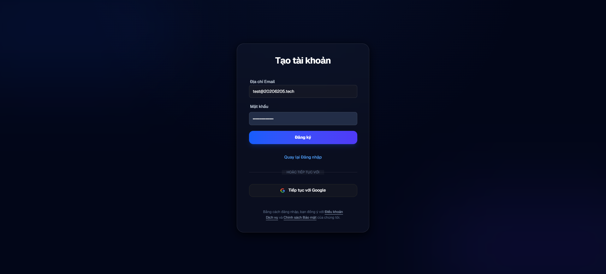

Hướng dẫn:

1. Nhập email và mật khẩu.
2. Bấm nút đăng ký.
3. Kiểm tra thông báo yêu cầu xác thực email.

### Thông báo xác thực email


Hướng dẫn:

1. Sau khi đăng ký, hệ thống hiển thị trạng thái chờ xác thực.
2. Người dùng mở hộp thư email đã đăng ký.
3. Bấm liên kết xác thực để kích hoạt tài khoản.

### Email xác thực đăng ký


Hướng dẫn:

1. Mở email xác thực từ hệ thống.
2. Kiểm tra đúng địa chỉ email và nội dung xác thực.
3. Bấm liên kết xác nhận để quay lại hệ thống.

### Đăng nhập

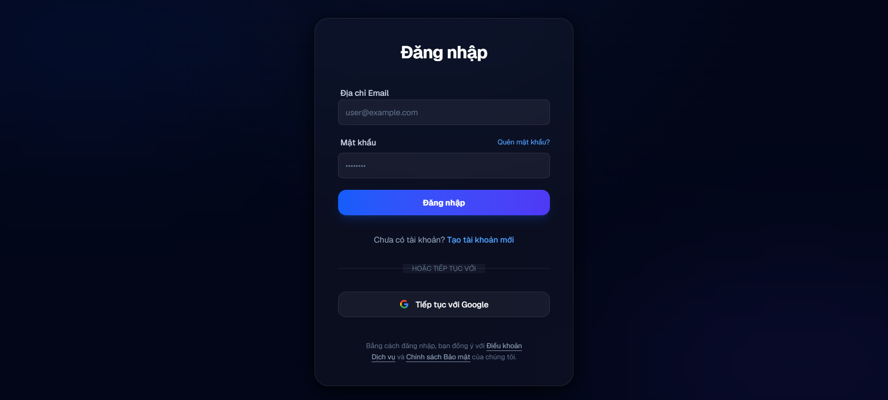

Hướng dẫn:

1. Nhập email và mật khẩu.
2. Bấm đăng nhập.
3. Nếu tài khoản bật MFA, hệ thống chuyển sang bước xác thực bổ sung.

### Thiết lập MFA bằng mã QR


Hướng dẫn:

1. Mở ứng dụng xác thực trên điện thoại.
2. Quét mã QR hiển thị trên màn hình.
3. Lưu cấu hình MFA trong ứng dụng xác thực.

### Xác minh mã MFA

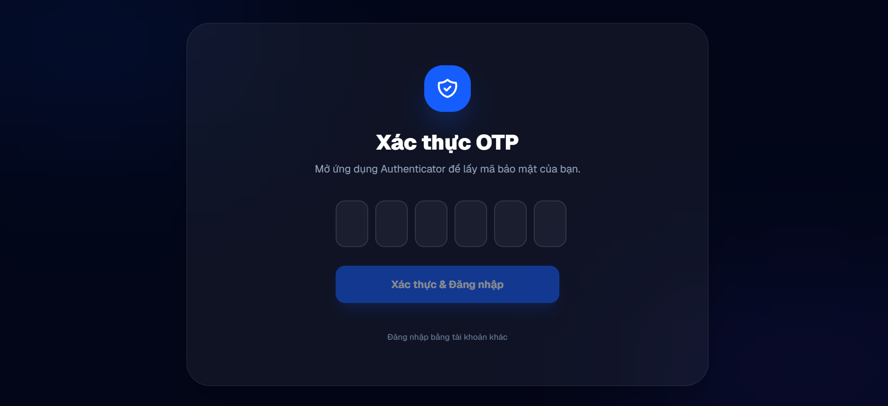

Hướng dẫn:

1. Lấy mã OTP mới nhất từ ứng dụng xác thực.
2. Nhập mã OTP vào màn hình xác minh.
3. Bấm xác nhận để hoàn tất đăng nhập hoặc kích hoạt MFA.

### Hồ sơ người dùng


Hướng dẫn:

1. Mở trang hồ sơ cá nhân.
2. Xem hoặc cập nhật thông tin hiển thị.
3. Lưu thay đổi để hệ thống cập nhật hồ sơ.

### Đổi mật khẩu và MFA


Hướng dẫn:

1. Mở phần bảo mật tài khoản.
2. Đổi mật khẩu hoặc quản lý xác thực MFA.
3. Xác nhận thao tác theo yêu cầu của hệ thống.

### Cài đặt người dùng

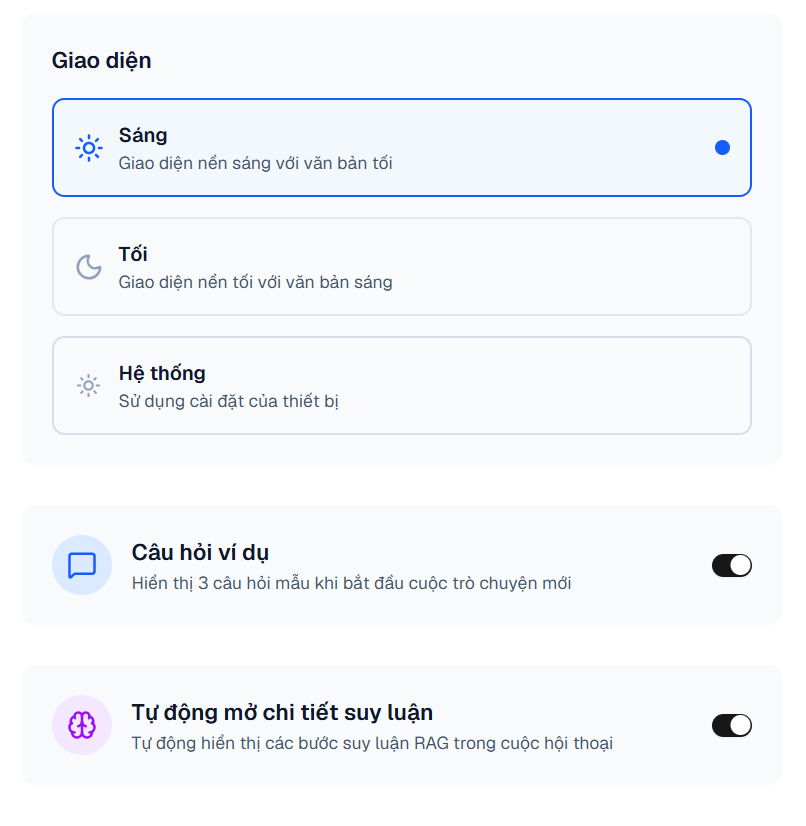

Hướng dẫn:

1. Mở trang cài đặt.
2. Điều chỉnh các tùy chọn cá nhân như giao diện, giọng nói hoặc cấu hình chat.
3. Bấm lưu để áp dụng cấu hình.

### Khôi phục mật khẩu


Hướng dẫn:

1. Nhập email đã đăng ký.
2. Bấm gửi yêu cầu khôi phục.
3. Mở email khôi phục mật khẩu và làm theo hướng dẫn.

### Email khôi phục mật khẩu


Hướng dẫn:

1. Mở email khôi phục mật khẩu.
2. Bấm liên kết đặt lại mật khẩu.
3. Nhập mật khẩu mới trên màn hình được chuyển hướng.

## 2. Trò chuyện, ghi chú và chia sẻ

### Chat văn bản


Hướng dẫn:

1. Nhập câu hỏi vào khung chat.
2. Chọn tùy chọn bổ sung nếu cần, ví dụ reasoning hoặc tài liệu đính kèm.
3. Gửi câu hỏi và theo dõi phản hồi dạng streaming.

### Chat bằng micro


Hướng dẫn:

1. Bấm biểu tượng micro để bắt đầu nhập bằng giọng nói.
2. Cho phép trình duyệt truy cập micro nếu được hỏi.
3. Nói câu hỏi và chờ hệ thống xử lý.

### Tạo ghi chú bookmark


Hướng dẫn:

1. Chọn cuộc hội thoại cần lưu.
2. Chọn hoặc tạo thư mục bookmark.
3. Nhập ghi chú và bấm lưu.

### Quản lý ghi chú bookmark


Hướng dẫn:

1. Mở danh sách bookmark.
2. Tìm cuộc hội thoại hoặc thư mục cần quản lý.
3. Chỉnh sửa ghi chú, đổi thư mục hoặc mở lại cuộc hội thoại.

### Tạo liên kết chia sẻ


Hướng dẫn:

1. Mở cuộc hội thoại cần chia sẻ.
2. Bấm tạo liên kết chia sẻ.
3. Sao chép liên kết sau khi hệ thống tạo xong.

### Quản lý chia sẻ


Hướng dẫn:

1. Mở danh sách liên kết chia sẻ.
2. Kiểm tra trạng thái từng liên kết.
3. Thu hồi liên kết nếu không muốn tiếp tục chia sẻ.

### Liên kết chia sẻ không khả dụng


Hướng dẫn:

1. Người nhận mở liên kết chia sẻ.
2. Nếu liên kết đã bị thu hồi hoặc không tồn tại, hệ thống hiển thị thông báo không khả dụng.
3. Liên hệ người chia sẻ để nhận liên kết mới nếu cần.

### Liên kết chia sẻ khả dụng


Hướng dẫn:

1. Mở liên kết chia sẻ hợp lệ.
2. Xem nội dung hội thoại được chia sẻ.
3. Dùng nội dung này để tham khảo mà không cần quyền chỉnh sửa cuộc hội thoại gốc.

### Thu hồi chia sẻ


Hướng dẫn:

1. Chọn liên kết chia sẻ cần thu hồi.
2. Bấm thu hồi hoặc hủy chia sẻ.
3. Xác nhận thao tác để liên kết không còn truy cập được.

### Xóa cuộc trò chuyện

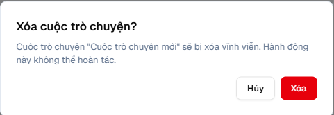

Hướng dẫn:

1. Chọn cuộc trò chuyện cần xóa.
2. Bấm thao tác xóa.
3. Xác nhận để hệ thống xóa hoặc ẩn cuộc trò chuyện khỏi danh sách.

## 3. Quản trị hệ thống

### Quản lý gói VIP

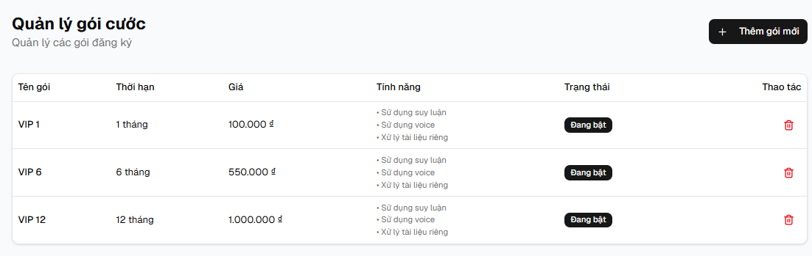

Hướng dẫn:

1. Admin mở trang quản lý gói VIP.
2. Xem danh sách gói hiện có.
3. Tạo mới, cập nhật hoặc vô hiệu hóa gói theo nhu cầu.

### Quản lý nhân vật

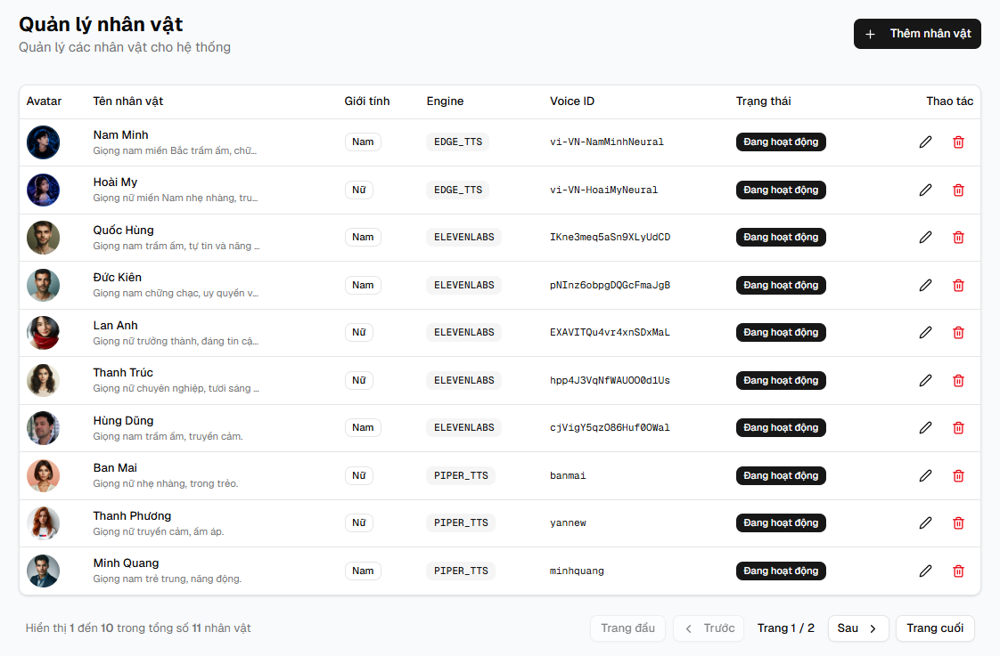

Hướng dẫn:

1. Admin mở trang quản lý nhân vật.
2. Nhập thông tin nhân vật, prompt, ảnh đại diện và giọng nói.
3. Lưu để nhân vật xuất hiện trong hệ thống.

### Quản lý engine

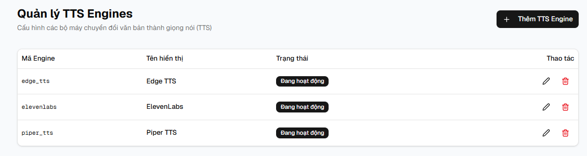

Hướng dẫn:

1. Admin mở trang cấu hình engine.
2. Kiểm tra trạng thái các engine đang hỗ trợ.
3. Bật, tắt hoặc cập nhật thông tin engine.

### Quản lý giọng nói

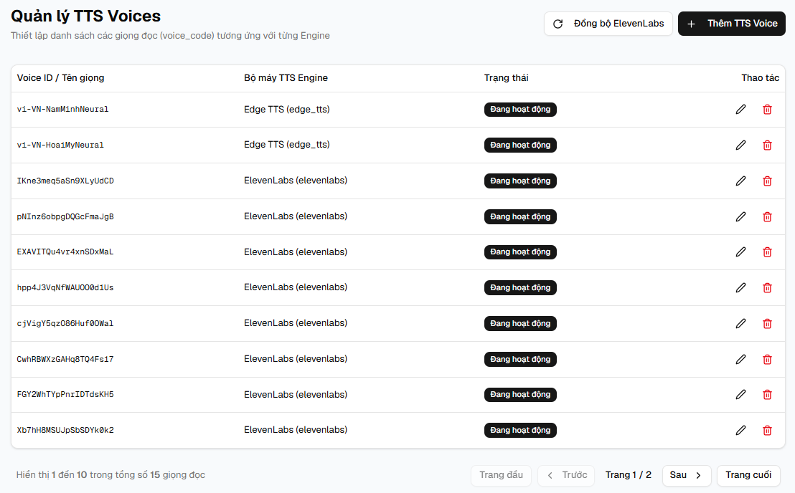

Hướng dẫn:

1. Admin mở trang giọng nói.
2. Đồng bộ hoặc cập nhật danh sách voice.
3. Gắn voice phù hợp cho nhân vật AI.

### Pipeline dữ liệu VBPL

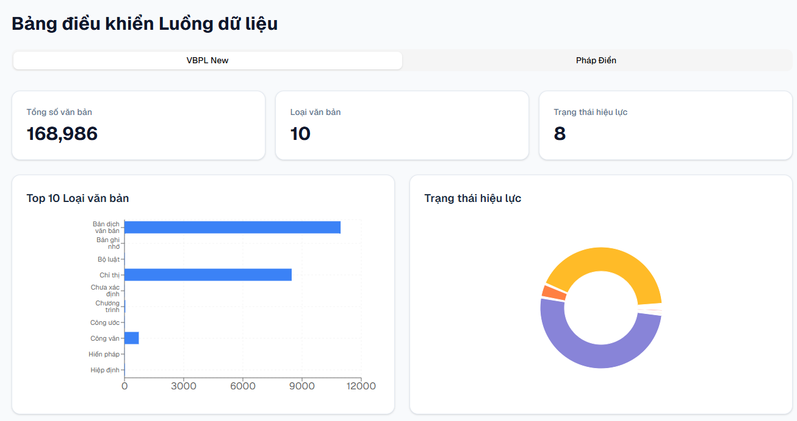

Hướng dẫn:

1. Admin mở trang pipeline dữ liệu VBPL.
2. Theo dõi trạng thái xử lý dữ liệu.
3. Kiểm tra tiến độ hoặc lỗi nếu có.

### Pipeline dữ liệu Pháp Điển

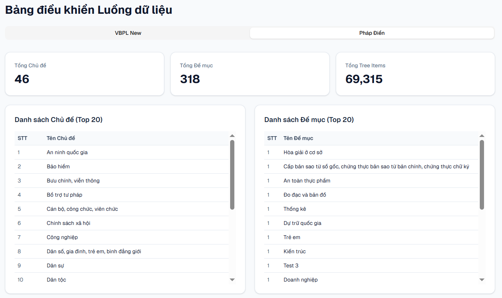

Hướng dẫn:

1. Admin mở trang pipeline Pháp Điển.
2. Xem thống kê cấu trúc và tiến độ xử lý.
3. Dùng thông tin này để theo dõi chất lượng dữ liệu nền.

## 4. Thanh toán và gói VIP

### Danh sách gói thanh toán

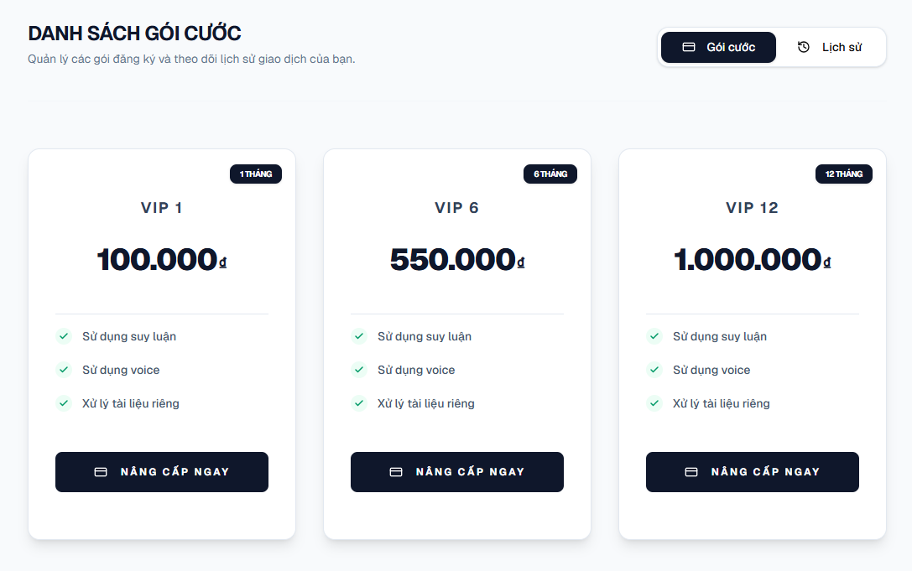

Hướng dẫn:

1. Người dùng mở trang gói VIP.
2. So sánh quyền lợi, giá và thời hạn từng gói.
3. Chọn gói phù hợp để tiến hành thanh toán.

### Lịch sử thanh toán

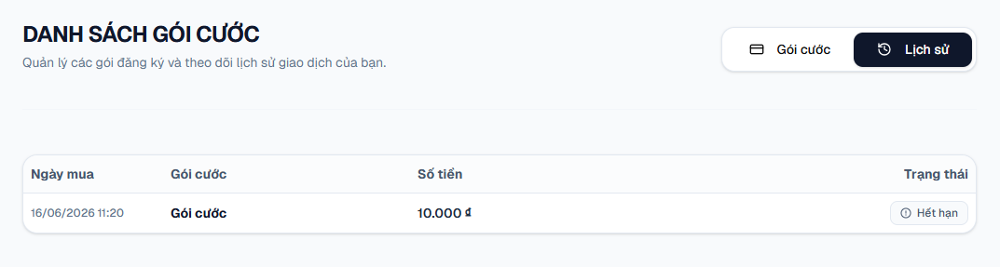

Hướng dẫn:

1. Mở trang lịch sử giao dịch.
2. Kiểm tra trạng thái, thời gian và gói đã thanh toán.
3. Dùng thông tin này để đối soát giao dịch khi cần.

### Thanh toán thành công

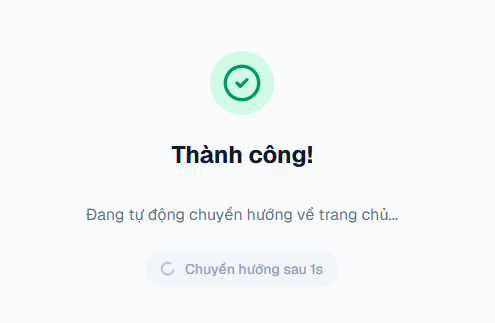

Hướng dẫn:

1. Sau khi thanh toán, hệ thống hiển thị kết quả thành công.
2. Kiểm tra thông tin gói VIP vừa kích hoạt.
3. Quay lại hệ thống để sử dụng các tính năng VIP.

### Email thanh toán thành công

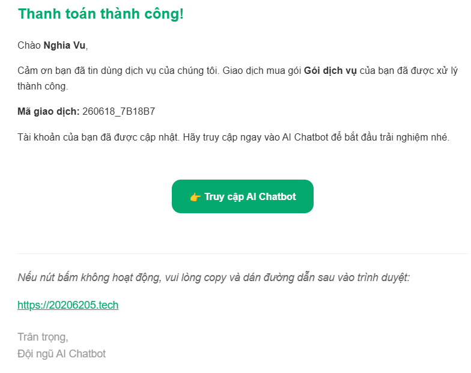

Hướng dẫn:

1. Mở email thông báo thanh toán.
2. Kiểm tra thông tin gói, thời hạn và trạng thái giao dịch.
3. Lưu email để đối chiếu khi cần hỗ trợ.

### Gói VIP đang hoạt động

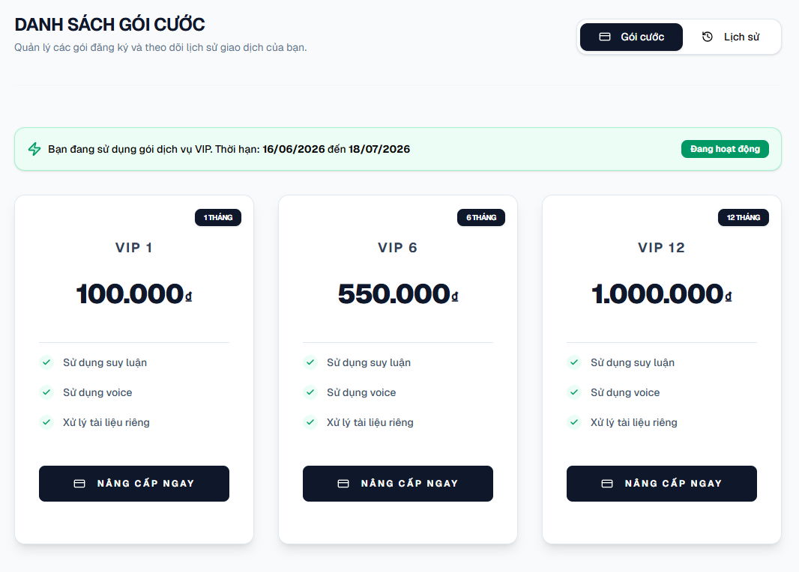

Hướng dẫn:

1. Mở trang gói VIP sau khi thanh toán.
2. Kiểm tra dấu hiệu gói đang hoạt động.
3. Sử dụng các tính năng yêu cầu VIP như reasoning, voice chat hoặc tài liệu cá nhân.

## 5. Voice chat

### Chọn giọng nói

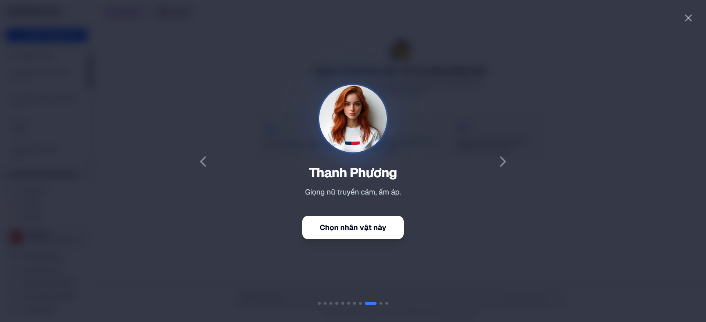

Hướng dẫn:

1. Mở phần chọn giọng nói hoặc nhân vật.
2. Nghe thử hoặc xem thông tin từng giọng.
3. Chọn giọng phù hợp cho phiên trò chuyện.

### Trò chuyện bằng giọng nói

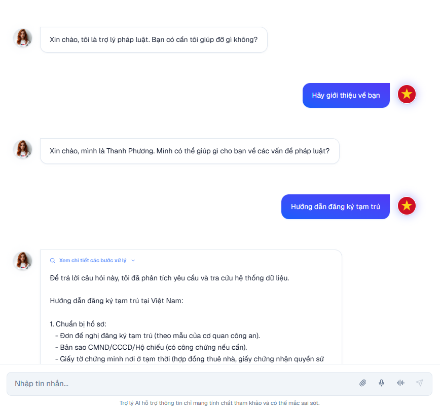

Hướng dẫn:

1. Bắt đầu phiên voice chat.
2. Nói câu hỏi hoặc yêu cầu vào micro.
3. Nghe phản hồi bằng giọng nói và theo dõi trạng thái xử lý trên giao diện.

## 6. Tài liệu cá nhân

### Tải lên tài liệu

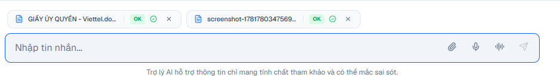

Hướng dẫn:

1. Chọn file tài liệu từ thiết bị.
2. Bấm tải lên.
3. Chờ hệ thống xử lý nền trước khi dùng tài liệu trong chat.

### Chat với tài liệu

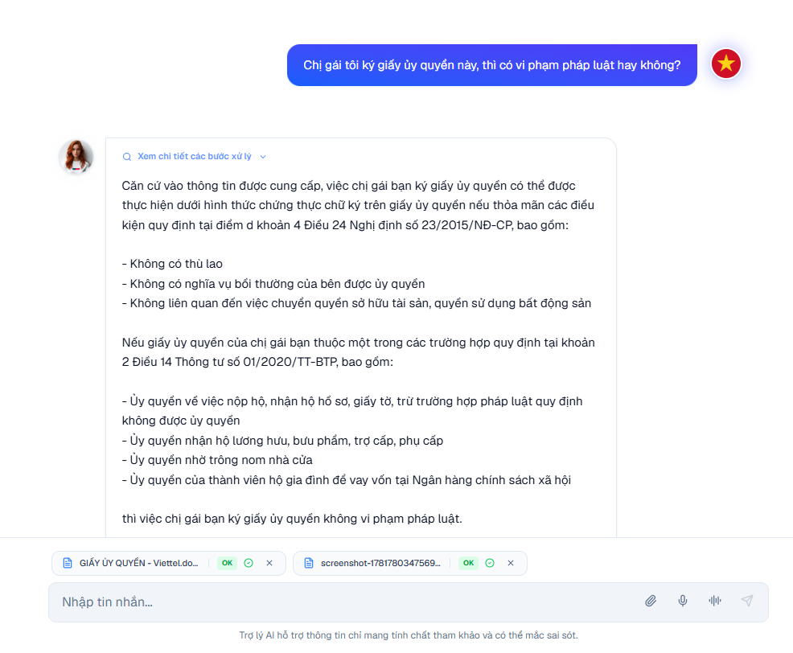

Hướng dẫn:

1. Chọn tài liệu đã xử lý thành công.
2. Đặt câu hỏi liên quan đến nội dung tài liệu.
3. Xem câu trả lời và nguồn tham chiếu do hệ thống trả về.
